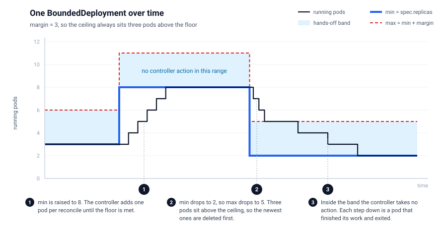
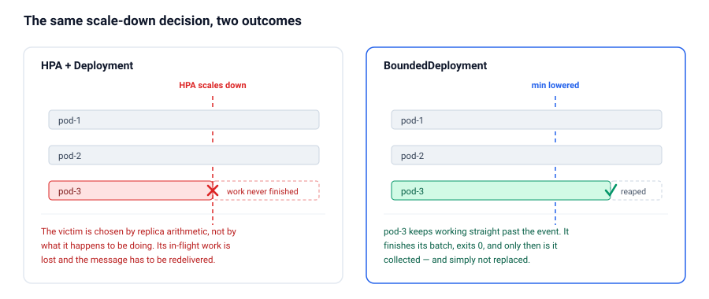
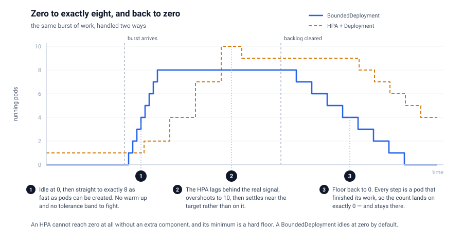
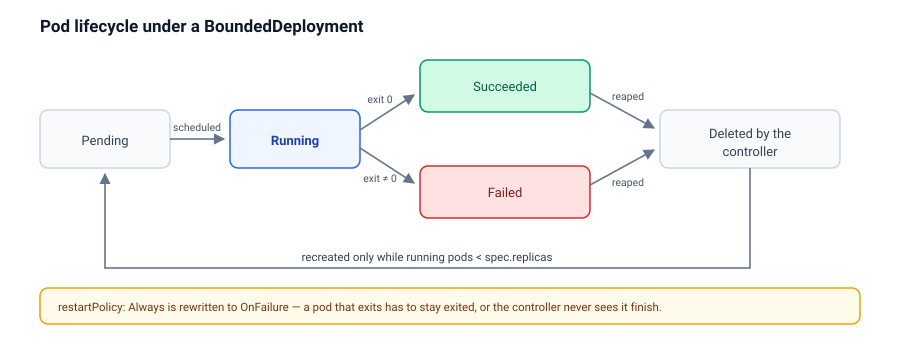
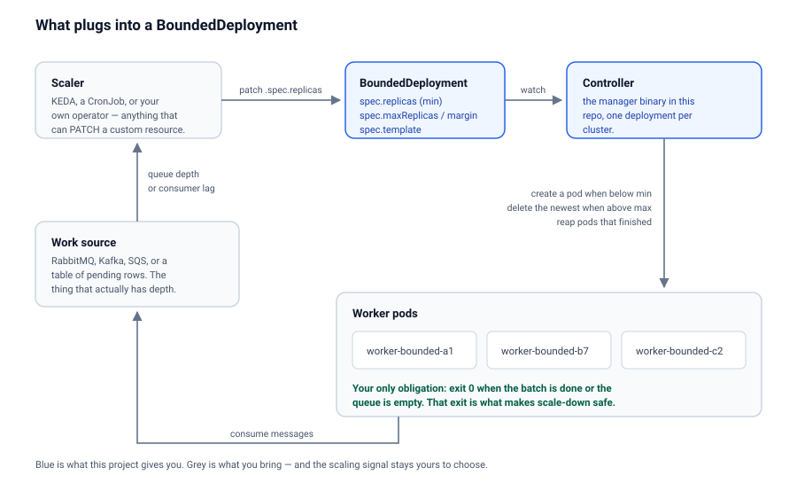

# k8s-bounded-deployment

A Kubernetes controller for workloads that should scale up on a signal you trust, and
scale down only once the work is actually finished.

`BoundedDeployment` is a custom resource that holds a **floor** and a **ceiling** on the
number of running pods. Between those two lines it does nothing at all: pods leave when
they decide they are done, not when a controller decides it would like fewer of them.

It idles at zero, goes to exactly the replica count you ask for, and comes back to zero
without discarding work in progress — see [Zero to X, precisely](#zero-to-x-precisely).



## Why not just use an HPA?

The HorizontalPodAutoscaler is a good fit for stateless request handlers, where any pod is
as disposable as any other and CPU tracks load closely. For queue workers, batch consumers
and long jobs, two of its properties actively hurt.

**It terminates pods that are busy.** Scaling down means choosing victims, and the choice
is made on replica arithmetic — nothing in it knows that one pod is ninety seconds into a
four-minute job. The work in flight is lost, the message goes back on the queue, and the
job is done twice. Teams usually paper over this with long `terminationGracePeriodSeconds`
and careful `SIGTERM` handling, which turns every worker into a small distributed-systems
problem.

**It scales on metrics that only correlate with the thing you care about.** CPU and memory
are proxies for load. A worker blocked on a slow database is nearly idle by CPU and
completely saturated in reality. You end up tuning thresholds against a signal that was
never the signal.

`BoundedDeployment` inverts both. The scale-up signal comes from whatever you decide is
authoritative — queue depth, consumer lag, a backlog count — because *you* set the floor.
Scale-down is by attrition: the pod finishes, exits, and simply is not replaced.



## How it works

The controller watches each `BoundedDeployment` and its pods, and applies three rules.

| Situation | What the controller does |
| --- | --- |
| Running pods **below** `spec.replicas` | Creates one pod per reconcile until the floor is met |
| Running pods **between** floor and ceiling | Nothing |
| Running pods **above** the ceiling | Deletes the **newest** pod, one per reconcile |

Two things are worth stressing.

The floor is `spec.replicas`. The name is inherited from `Deployment`, but the meaning is
different: it is a *minimum*, not a target. The ceiling is `spec.maxReplicas` if you set
it, otherwise `spec.replicas + spec.margin`. If you set neither, there is no ceiling.

When the controller does have to delete a pod for being over the ceiling, it deletes the
newest one — the pod with the least work invested in it, so the pods furthest through
their work are the ones left alone. It is the only deletion heuristic here, and unlike a
`ReplicaSet`, which reaches for it only as a tiebreaker after readiness and node spread,
it is the whole policy.

On top of the three rules, the controller collects pods that have reached `Succeeded` or
`Failed` and deletes them. That reaping is what makes the whole thing move: a finished pod
is removed, and if that drops the count below the floor, a fresh one takes its place.

### The margin is a scale-down budget

The gap between floor and ceiling is the number of surplus pods you are willing to pay for
while you wait for them to finish on their own.

Drop the floor from 10 to 2 with `margin: 3` and the ceiling becomes 5. The three pods
above the ceiling are deleted one per reconcile, in quick succession; the remaining five
are left to drain naturally down to 2. Set a large margin and nothing is ever force-deleted, at the cost of running
surplus pods for longer. Set `margin: 0` and the resource behaves like a strict replica
count, killing on every scale-down — which is exactly the behaviour you came here to avoid.

## Zero to X, precisely

`spec.replicas: 0` is a valid resting state, and it is the default. A `BoundedDeployment`
with a floor of zero runs no pods and costs nothing, while keeping the pod template, the
ceiling and the resource itself in place, ready to go.



Going from 0 to X is one patch:

```bash
kubectl patch boundeddeployment semantic-indexer -n dev \
  --type merge -p '{"spec":{"replicas":8}}'
```

You get **exactly eight**. Three properties combine to make that true, and each of them is
something an HPA cannot offer:

**It converges immediately, not on a polling interval.** The controller watches the pods it
owns, so every pod creation wakes the next reconcile. Pods are created one per reconcile,
back to back, as fast as the API server and scheduler will take them — there is no metrics
scrape interval and no sync period in the path.

**The number is the number.** There is no tolerance band and no averaging. An HPA has a
10% tolerance by default and a 300-second scale-down stabilization window, so it settles
*near* a target rather than on it; ask for eight and you may sit at nine for a while. Here,
the floor is a floor.

**Zero is reachable in both directions.** An HPA's `minReplicas` cannot be zero without an
extra component — `HPAScaleToZero` is still a feature gate, which is a large part of why
people reach for KEDA. Set the floor back to `0` and pods finish, get collected, and are
not replaced. The count lands on exactly zero and stays there.

That last step is where the drain semantics matter most. Coming down to zero you have two
options:

| You want | Set | Result |
| --- | --- | --- |
| Graceful drain | `replicas: 0`, `margin: N` | Up to `N` pods keep running until they finish their work. Nothing is killed. |
| Immediate stop | `replicas: 0`, `maxReplicas: 0` | The ceiling is zero, so every pod is deleted now, finished or not. |

For a bursty workload — a nightly import, an on-demand reindex, a batch that arrives when
a customer uploads something — this gives you the shape you actually want: nothing running
at rest, exactly the parallelism you asked for while the work exists, and a clean return to
nothing once it is done, with no half-finished jobs thrown away on the way down.

## The contract: your pod has to be able to exit

This is the one real constraint, and everything above depends on it.



A `BoundedDeployment` pod is expected to do some work and then **exit 0** — when its batch
is done, when the queue comes up empty, or after a self-imposed lifetime. A pod that runs
forever is never collected, so the count never falls and scale-down never happens.

Because of that, the controller rewrites `restartPolicy: Always` to `OnFailure` on the
resource itself, and logs that it did. Under `Always` the kubelet restarts a container
that exits cleanly, so the pod never reaches `Succeeded` and the controller never sees it
finish.

This makes `BoundedDeployment` a good fit for queue consumers, batch and ETL workers,
scheduled importers, and inference or indexing jobs. It is a poor fit for long-lived HTTP
servers — see [What this is not](#what-this-is-not).

## Install

The controller is a single deployment plus one CRD, and it is namespace-agnostic.

### From a release

```bash
kubectl apply -f https://github.com/stonal-tech/k8s-bounded-deployment/releases/latest/download/install.yaml
```

This installs the CRD and the controller into the `k8s-bounded-deployment-system`
namespace. Images are published to `ghcr.io/stonal-tech/k8s-bounded-deployment`.

### From source

```bash
git clone https://github.com/stonal-tech/k8s-bounded-deployment.git
cd k8s-bounded-deployment
make install
make deploy IMG=ghcr.io/stonal-tech/k8s-bounded-deployment:latest
```

`make install` applies just the CRD; `make deploy` adds the controller. To build and push
your own image instead, use `make docker-build docker-push IMG=<your-registry>/<name>:<tag>`
and pass the same `IMG` to `make deploy`.

### Verify

```bash
kubectl get crd boundeddeployments.deploy.stonal.io
kubectl -n k8s-bounded-deployment-system get deploy
```

### Uninstall

```bash
make undeploy
make uninstall
```

## Configuring a BoundedDeployment

```yaml
apiVersion: deploy.stonal.io/v1
kind: BoundedDeployment
metadata:
  name: semantic-indexer
spec:
  replicas: 2      # the floor: never fewer than this
  margin: 3        # ceiling = replicas + margin = 5
  template:
    metadata:
      labels:
        app: semantic-indexer
    spec:
      restartPolicy: OnFailure
      containers:
        - name: worker
          image: ghcr.io/example/semantic-indexer:1.4.0
          env:
            - name: EXIT_WHEN_QUEUE_EMPTY
              value: "true"
```

### Spec

| Field | Type | Required | Meaning |
| --- | --- | --- | --- |
| `replicas` | integer | no (defaults to `0`) | The floor. The controller creates pods until this many are running. |
| `maxReplicas` | integer | no | Absolute ceiling. Must be greater than or equal to `replicas`. |
| `margin` | integer | no | Ceiling expressed as a distance above the floor. Ignored when `maxReplicas` is set. |
| `template` | PodTemplateSpec | yes | The pod to run. Must declare at least one container. |

If both `maxReplicas` and `margin` are absent there is no ceiling, and surplus pods are
only ever removed by finishing. That is a legitimate configuration, but an explicit
ceiling is the safer default.

### Status

| Field | Meaning |
| --- | --- |
| `replicas` | Pods currently alive and not terminating |
| `readyReplicas` | Of those, how many pass their readiness probe |
| `templateHash` | Hash of the current pod template |

```bash
kubectl get bd            # "bd" is the registered short name
```

```
NAME               MIN   MAX   MARGIN   CURRENT   READY
semantic-indexer   2           3        4         4
```

### What the controller puts on your pods

Pods are named `<boundeddeployment-name>-bounded-<suffix>`, carry the label
`deploy.stonal.io/boundeddeployment: <name>`, and carry the annotation
`deploy.stonal.io/template-hash`. Ownership is set for garbage collection, so deleting the
`BoundedDeployment` deletes its pods. The label is also how the controller finds pods, so
do not remove or overwrite it in your template.

## Driving it from a real signal

The controller deliberately has no opinion about *when* to scale. It reconciles toward the
floor you give it; deciding the floor is your job, and that is where the precision comes
from.



Scaling up is a patch:

```bash
kubectl patch boundeddeployment semantic-indexer -n dev \
  --type merge -p '{"spec":{"replicas":10}}'
```

### With a message queue

The natural pairing. A sidecar, a CronJob, or [KEDA](https://keda.sh) reads the queue depth
and patches the floor; the workers consume, and each one exits 0 once the queue is drained
or its batch is complete.

```yaml
# KEDA scaling the BoundedDeployment instead of a Deployment
apiVersion: keda.sh/v1alpha1
kind: ScaledObject
metadata:
  name: semantic-indexer
spec:
  scaleTargetRef:
    apiVersion: deploy.stonal.io/v1
    kind: BoundedDeployment
    name: semantic-indexer
  triggers:
    - type: rabbitmq
      metadata:
        queueName: semantic-index
        mode: QueueLength
        value: "50"
```

KEDA drives this through the `/scale` subresource. That subresource is **not** enabled on
the CRD today, so this pairing needs the scale subresource added first — see
[Known gaps](#known-gaps). A small controller or CronJob that issues the `kubectl patch`
above works right now.

### With any other system

Anything that can `PATCH` a custom resource can drive it: a cron that raises the floor
before a nightly import and lowers it afterwards, an application that knows its own
backlog, or a webhook from an upstream pipeline. Because the floor is just a number in a
spec, the scaling policy stays in the system that actually understands the load.

## Adopting an existing Deployment

A second controller can convert a `Deployment` in place. Annotate it:

```yaml
metadata:
  annotations:
    stonal.io/bounded-enabled: "true"
    stonal.io/bounded-margin: "3"     # or stonal.io/bounded-max: "10"
```

The controller creates a `BoundedDeployment` with the same name and pod template, copies
`spec.replicas` across as the floor, and then **scales the original Deployment to zero**.
Setting either `bounded-margin` or `bounded-max` is enough to enable it;
`bounded-enabled: "false"` disables it explicitly.

Treat this as a one-way migration aid rather than a live bridge: the conversion happens
once, and later edits to the `Deployment` are not propagated. Read
[Known gaps](#known-gaps) before pointing it at anything you care about.

## Operating it

Watch a resource move:

```bash
kubectl get boundeddeployments -A -w -o jsonpath='{.metadata.namespace}:{.metadata.name} - SPEC: replicas:{.spec.replicas}, maxReplicas:{.spec.maxReplicas}  -  STATUS: replicas:{.status.replicas}, readyReplicas:{.status.readyReplicas}{"\n"}'
```

List the pods belonging to one:

```bash
kubectl get pods -l deploy.stonal.io/boundeddeployment=semantic-indexer
```

Controller logs are the fastest way to understand a decision — every create, delete and
reap is logged with its reason:

```bash
kubectl -n k8s-bounded-deployment-system logs deploy/k8s-bounded-deployment-controller-manager -f
```

### Controller flags

| Flag | Default | Purpose |
| --- | --- | --- |
| `--health-probe-bind-address` | `:8081` | Liveness and readiness endpoints |
| `--metrics-bind-address` | `0` (disabled) | Set to `:8443` for HTTPS or `:8080` for HTTP |
| `--metrics-secure` | `true` | Serve metrics over HTTPS with authn/authz |
| `--leader-elect` | `false` | Enable leader election for HA |
| `--enable-http2` | `false` | Off by default to avoid the HTTP/2 Rapid Reset CVEs |

## What this is not

Being clear about the boundaries is more useful than a feature list.

**It is not a Deployment replacement.** There is no rolling update. When you change
`spec.template`, every pod whose template hash no longer matches is deleted in the same
pass — all of them, at once — and replacements are then created one per reconcile. For a
worker fleet that is usually fine. For anything serving traffic it is an outage.

**It has no surge, no `maxUnavailable`, no PodDisruptionBudget integration.** Availability
during a template change is whatever your queue's redelivery semantics give you.

**It does not decide when to scale.** There is no metrics adapter and no queue integration
in this repo. Something else sets the floor.

**It does not manage a Service, and pods are not fungible endpoints.** Pods come and go by
design, on their own schedule.

## Known gaps

Honest accounting of what is rough, as of this writing:

- **No `/scale` subresource** on the CRD, so `kubectl scale` and KEDA's generic scaler
  cannot target a `BoundedDeployment` yet. Use `kubectl patch`.
- **The `Deployment` adoption controller is one-shot.** It creates the `BoundedDeployment`
  and never updates it, so later changes to the source `Deployment` do not propagate — but
  it does keep the `Deployment` scaled to zero.
- **No rolling update**, as described above.
- **The test suite is Kubebuilder scaffolding.** The generated specs assert almost nothing
  about the reconcile logic.
- **No conditions on status**, so `kubectl wait --for=condition=...` has nothing to wait on.

## Development

Requires Go 1.24+. Tooling is downloaded into `./bin` on demand.

```bash
make build          # build the manager binary
make run            # run against the cluster in your current kubeconfig
make test           # unit tests via envtest
make test-e2e       # end-to-end tests, needs a Kind cluster
make lint           # golangci-lint
make manifests generate   # regenerate CRDs, RBAC and DeepCopy methods
```

Sample resources live in `config/samples` and can be applied with `make samples`.

The project is built with [Kubebuilder](https://book.kubebuilder.io) v4 and
[controller-runtime](https://github.com/kubernetes-sigs/controller-runtime).

## License

Apache 2.0 — see [LICENSE](LICENSE).
